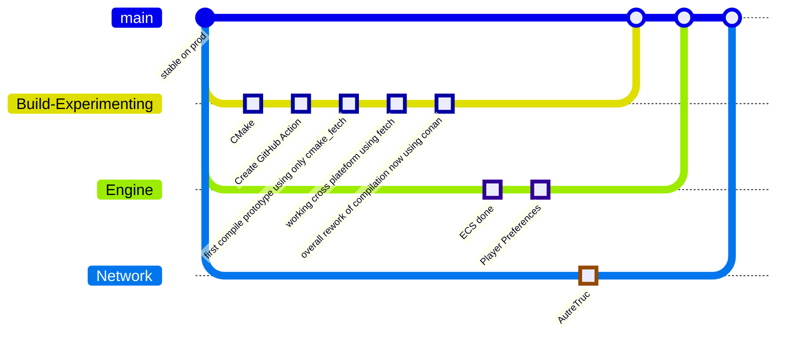
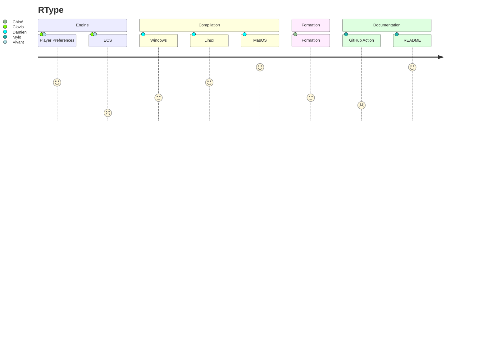

# R-TYPE

A 3rd year Epitech Project.

This project aims to create an online multiplayer R-Type game. We had to implement a multi-threaded server using Asio and a graphical client in SFML.

For the one unfamliar with the R-TYPE genre, [here is a bit about it](http://www.hardcoregaming101.net/r-type/).

## Installation :
### Linux:
```comment on instale sur Linux```
### Windows:
```comment on instale sur Windows```
### MacOS:
```comment on instale sur MacOS```


## Network :
- [ ] A network game: each player use a distinct client on the network, connecting to a server having final authorithy on what is really happening in the game.
- [ ] It MUST be multithreaded. The server MUST NOT block or wait for clients messages, as the game MUST run frame after frame on the server !
- [ ] It is strongly recommended that the client also run the game logic code, to prevent having too much issues due to network lag. In any case the server MUST have authority on what happens in the end.
- [ ] You MUST design a binary protocol for client/server communications.
- [ ] You MUST use UDP for communications between the server and the clients. 
- [ ] Think about your protocol completeness, and in particular, the handling of erroneous messages. Such malformed messages or packets MUST NOT lead the client or server to crash.
- [ ] You MUST document your protocol. See the previous section on documentation for more information about what is expected for the protocol documentation.
- [ ] The server MUST be multithreaded.
- [ ] If a client crashes for any reason, the server MUST continue to work and MUST notify other clients in the same game that a client crashed.

## Game :
- [ ] The client MUST display a slow horizontal scrolling background representing space with stars, planets.. . This is the star-field.
- [ ] The star-field scrolling must NOT be tied to the CPU speed. Instead, you MUST use timers.
- [ ] Players MUST be able to move using the arrow keys.
- [ ] The four players in a game MUST be distinctly identifiable (via color, sprite, etc.)
- [ ] There MUST be Bydos slaves in your game.
- [ ] Monsters MUST be able to spawn randomly on the right of the screen
- [ ] The server MUST notify each client when a monster spawns, is destroyed, fires, kills a player, and so on.. 

## Architecture :


## Project distribution :


## Team

The team is composed of :

chloe.lere@epitech.eu 

clovis.schneider@epitech.eu

vivant.garrigues@epitech.eu

mylo.jeandat@epitech.eu

damien.demontis@epitech.eu
